# Modelo libreria Campus

- Identificar las necesidades específicas del centro educativo y los usuarios, como estudiantes y profesores

- Diseñar una interfaz de usuario intuitiva y fácil de usar.

- Especificar las características clave, como la disponibilidad de préstamo y reserva de libros, gestión de cuentas de usuario, historial y producto favorito

- Planificar la arquitectura de la aplicación y la base de datos.

  

## Objetivo General:

Crear una plataforma web intuitiva y accesible que permita a los usuarios encontrar fácilmente los recursos que necesitan, ofreciendo una amplia gama de recursos, incluidos libros y cualquier otro material necesario para la educación, permitiéndoles tomar prestados libros y materiales de forma rápida y sencilla.

## Objetivos Específicos:

- [x] **Diseño de la Base de Datos**

- [x] **Desarrollo de la API**

- [x] **Gestión de Versiones**

- Implementar un sistema eficiente de gestion de prestamos
- Garantizar la seguridad y privacidad de los datos
- Diseñar una interfaz amigable que permita a los usuarios navegar fácilmente


## Requisitos previos

- Node js instalado en tu maquina (Recomendada v18.16.0)

  - Instalación de Node usando NVM para Linux => nvm install v18.16.0

  - Instalación de Node usando NVM para Windows => https://github.com/coreybutler/nvm-windows

  - Verifica si se instaló correctamente:

    ```
    node -v
    npm -v
    ```

- MongoDB instalado y configurado con las credenciales necesarias para conectarse a la base de datos.

## Instalación

**Repositorio a clonar:**

```bat
https://github.com/davidRamirez1005/library_campus.git
```

## [Instrucciones de configuración]

1. Descarga las dependencias y dependencias de desarrollo, usar: `npm i` o `npm update`

2. Una vez descargado nodejs y las dependencias crear el archivo **.env**, lo siguiente es la estructura que debe usar, tambien está en .env.example

   ```bash
   ATLAS_USER=""
   ATLAS_PASSWORD=""
   ATLAS_DB="db_campus_Library"
   JWT_SECRET="jwt_secret"
   
   VITE_PORT_BACKEND = 
   VITE_PORT_FRONTEND = 
   VITE_HOSTNAME = ''
   ```

   

3. iniciar nodemon para backend : `npm run start`

4. iniciar vite para frontend :  `npm run dev`

5. Establezca conección a atlas en mongo, luego dirijase a la carpeta **database**, seleccione la carpeta schema y ejecute el archivo, luego dirijase al archivo 'data.mongodb' y ejecute el archivo o use: (tenga en cuenta cambiar el cluster-code de acuerdo a su atlas, se encuentra en la carpeta config, archivo atlas.js)

   `mongodb+srv://<user>:<password>@cluster0.<clusterCode>.mongodb.net/`

## Diseño:

El diseño de la aplicacion se basó en la siguiente paleta de colores, además se optó por usar imagenes tipo 3D y diseño de interfaz minimalista, la eleccion de colores e imagenes se desarrolló en figama.

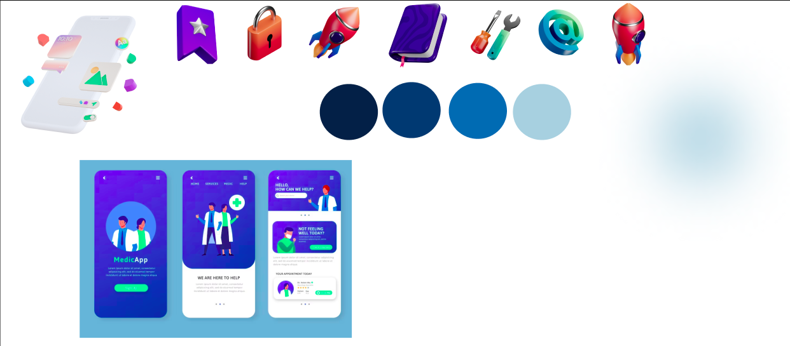

La interfaz es responsive para diferentes tamallos de pantalla, por lo que no tendrá problemas

## Instrucciones de uso

Al iniciar se dirige por defecto a la pagina de inicio, sigue los pasos para usar con comodidad y eficiencia la gestion de la biblioteca

### *Iniciar sesión como Administrador:*

#### Nota => credenciales para ingresar como administrador:
- Email = jdramirez1005@gmail.com
- contraseña = secreto1005

1. Digirirse por medio de la barra navegadora a la pagina de "Entrar", diligenciar el formulario de inicio de sesión con los datos requeridos, si no está registrado no lo dejará seguir

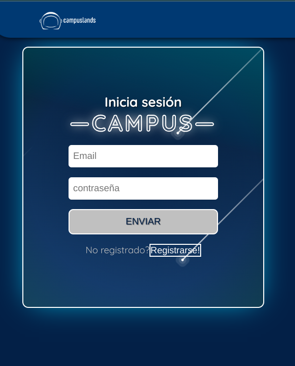

2. Ya en la pagina de administración puede agregar un nuevo administrador o agregar un nuevo producto:

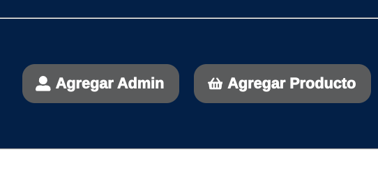

Diligencia los formularios con los datos requeridos, los campos estan validados tanto en backend como en frontend

3. En la primera sección de navegación puede observar:

- **favorito** => puede observar el libro que ha sido más veces prestado
- **Historial Usuario** => puede buscar por medio de la identificación del usuario que libros tiene en estado "prestado", actualmente
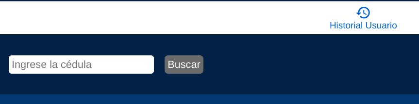
- **productos** => puede gestionar los producto como "agotando", "eliminando" o "disponible"
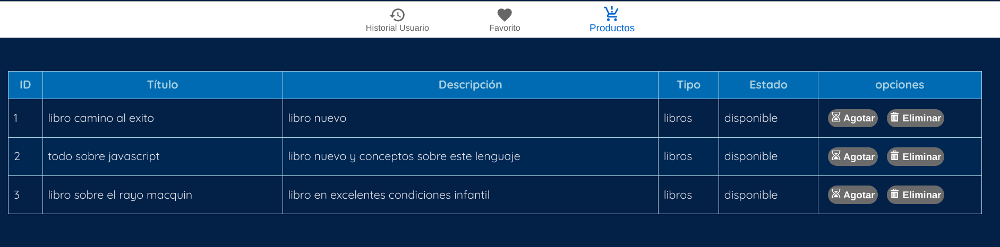

4. En la segunda sección de navegación puede:
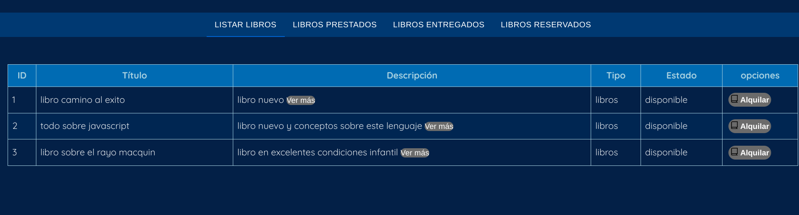
- **listar libros** => listar todos los libros, en el boton "ver más" puede observar información más detallada sobre el libro, en el boton alquilar puede hacer un "prestamo" o "reserva" llenando los campos requeridos, la fecha de entrega no puede ser menor a la fecha de inicio
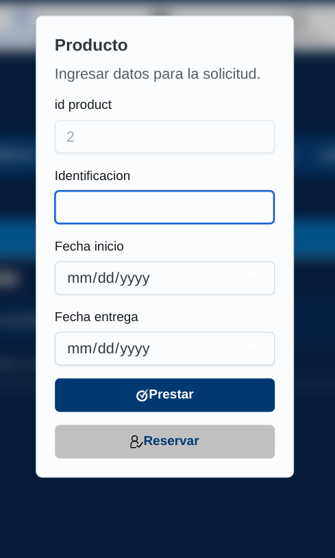
- **Listar prestados** => puede listar los libros que están en estado "prestado", tiene la opcion de pasar el libro a estado "entregado", cuando el usuario entregue el libro
- **Listar entregados** => puede listar los libros en estado "entregado", tiene la opción de volver a colocar en estado "disponible" el libro
- **Listar reservados** => puede aceptar una "reserva" ya realizada presionando el botón de prestado o puede volver a colocar en estado "disponible" si desea o el usuario no fue por el libro

5. En la sección de usuarios registrados puede visualizar la cantidad de usuarios registrados además si presiona el switch de "ver" podra ver la información de cada uno


------


### *Iniciar sesión como Usuario:*

1. Digirirse por medio de la barra navegadora a la sección de "Entrar", diligenciar el formulario de inicio de sesión con los datos requeridos, si no está registrado no lo dejará seguir y debera presionar el botón de registrarse (llenar los campos requeridos y volver a dirigirse a la pagina de entrar)


Diligencia los formularios con los datos requeridos, los campos estan validados tanto en backend como en frontend

3. Una ves ya de haber ingresado puede en la  sección de navegación puede observar:

- **favorito** => puede observar el libro que ha sido más veces prestado
- **Historial Usuario** => puede listar los libros que ha prestado presionando el botón de busca
   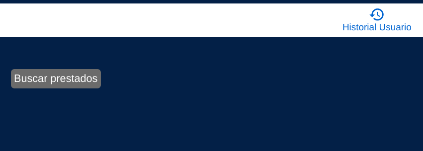
- **productos** => puede ver los productos disponibles, en el boton "ver más" puede visualizar mas detalles sobre el libro, si desea hacer la reserva presione el botón "reservar"
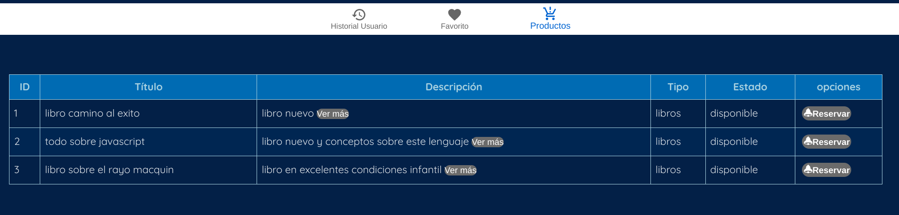
Diligencie los datos y su solicitud será remitida hacia la pagian de administración
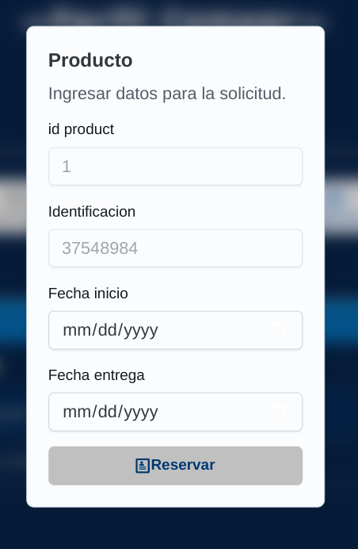


------


### INFORMACION DEL PROYECTO

1. Cuenta con protección de rutas
2. Tiene limite de tiempo para hcer peticiones donde para los metodos GET en de 1s y el LOGIN es de 5s
3. cuenta con págian 404

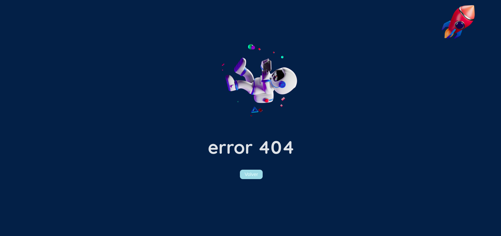

4. Dependencias y configuracion de desarrollo:
   - Frontend:
     - React
     - MUI
     - Axios
     - Bootstrap
     - CORS
     - React Router DOM
     - React Icons
   - Backend:
     - Express
     - MongoDB
     - Passport
     - Passport-HTTP-Bearer
     - Express-Rate-Limit
     - Express-Session
     - Express-Validator
   - DevDependencies:
     - Jest
     - ESLint
     - Vite


JOSE DAVID RAMIREZ M - CAMPUSLAND


